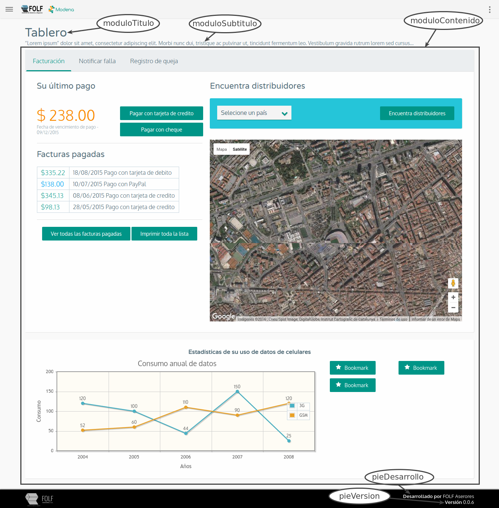
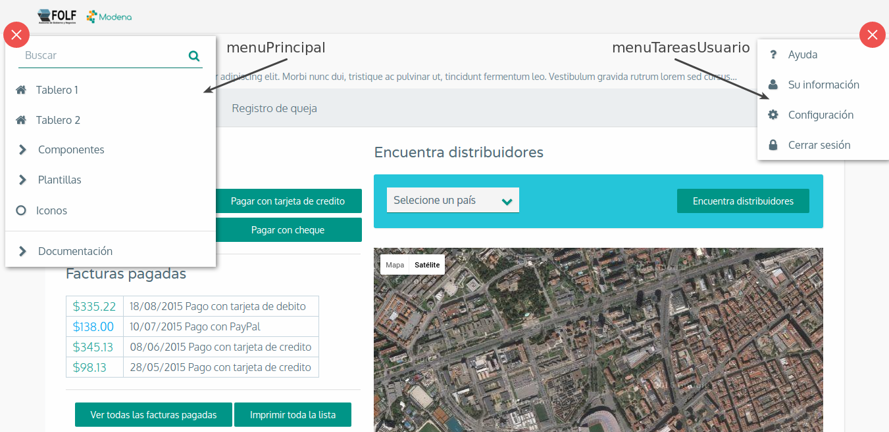
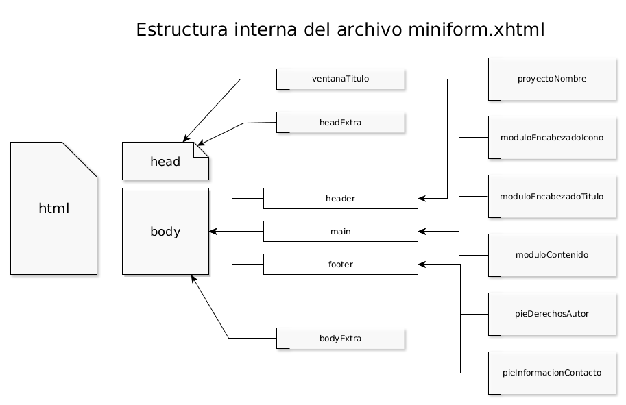
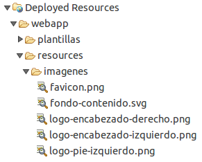

# Implementación

#### Contenido

[Instalación del tema](#instalacion)

[Configuración](#configuracion)

[Dependencias](#dependencias)

[Plantillas](#plantillas)
  * La estructura de las plantillas: ``principal.xhtml`` y ``secundaria.xhtml``
  * La estructura de la plantilla: ``miniform.xhtml``

[Imágenes](#imagenes)

## Instalación del tema

### Instalación del tema

Agregar el tema Modena es muy sencillo ya que el tema esta empaquetado en un
 archivo JAR de Java por ello sólo requiere de incluirlo en el classpath de la
 aplicación o en su caso sí se está usando Maven solo se debe incluir la
 dependencia dentro del archivo POM del proyecto.

### Artefacto Maven

**Requisitos previos**: Haber configurado el archivo ``settings.xml`` para que apunte al
 artifactory.

    <dependency>
        <groupId>mx.com.folfasesores</groupId>
        <artifactId>folf-modena</artifactId>
        <version>{version-mas-actual}</version>
    </dependency>

## Configuración

La única configuración requerida para aplicar el tema se realiza dentro del
 descriptor de despliegue es decir el archivo web.xml definiendo el parámetro de
 contexto ``primefaces.THEME``.

    <context-param>
        <param-name>primefaces.THEME</param-name>
        <param-value>folf-modena</param-value>
    </context-param>

Adicionalmente para el caso de JBoss o Wild**Fly** se debe añadir una
 configuración para que identifique la extensión de los archivos de fuentes
 (ttf, svg, eot, otf, woff) e imágenes (svg).

    <mime-mapping>
        <extension>eot</extension>
        <mime-type>application/vnd.ms-fontobject</mime-type>
    </mime-mapping>
    <mime-mapping>
        <extension>otf</extension>
        <mime-type>application/x-font-opentype</mime-type>
    </mime-mapping>
    <mime-mapping>
        <extension>ttf</extension>
        <mime-type>application/x-font-ttf</mime-type>
    </mime-mapping>
    <mime-mapping>
        <extension>woff</extension>
        <mime-type>application/x-font-woff</mime-type>
    </mime-mapping>
      <mime-mapping>
        <extension>woff2</extension>
        <mime-type>application/x-font-woff2</mime-type>
      </mime-mapping>
    <mime-mapping>
        <extension>svg</extension>
        <mime-type>image/svg+xml</mime-type>
    </mime-mapping>

## Dependencias

Su principal dependencia es PrimeFaces en su versión 5.3.

## Plantillas

Muchas aplicaciones Web siguen un patrón muy similar en sus páginas lo cual
 implica programar algunas partes repetitivas como lo son el header, el sidebar,
 el footer entre otras, estas actividades por lo que general provocan una
 pequeña pero significativa pérdida de tiempo; para reducir esa pérdida de
 tiempo y considerando la filosofía DRY dentro del proyecto existen 3 plantillas
 llamadas ``principal.xhtml``, ``secundaria.xhtml`` y ``miniform.xhtml`` las
 cuales definen la estructura básica de una página (en otras palabras definen
 la interfaz de usuario final), las cuales se implementan por medio de Facelets
 Templates. La estructura de las dos primeras es muy semejante, la única
 diferencia existente entre ambas es la presentación que el usuario verá. Por
 otro lado la tercera se ha pensado para ser usada en formularios muy sencillos
 como por ejemplo en una página de inicio de sesión (login), páginas
 informativas que no requieren de mucha interacción por parte del usuario final
 o incluso las páginas de error.

### La estructura de las plantillas: ``principal.xhtml`` y ``secundaria.xhtml``

En la imagen se puede observar cómo están estructuradas de manera internamente
 las plantillas.

Para su implementación solo habrá que crear un archivo xhtml incluyendo en él la
 etiqueta ``ui:composition`` y colocando en la propiedad template el valor
 ``/primefaces-folf-modena-templates/principal.xhtml``.

    <ui:composition xmlns="http://www.w3.org/1999/xhtml"
        xmlns:ui="http://xmlns.jcp.org/jsf/facelets"
        xmlns:h="http://xmlns.jcp.org/jsf/html"
        xmlns:p="http://primefaces.org/ui"
        template="/primefaces-folf-modena/plantillas/principal.xhtml">
        <!-- Su implementación va aquí -->
    </ui:composition>

Se recomienda crear una plantilla dentro del proyecto que incluya los menús y
 los elementos del pie de página ya que sin ellos se requerirá que en cada
 página sean declarados lo cual haría engorrosa la implementación de la
 plantilla; la creación de una plantilla dentro del mismo proyecto permitirá la
 reutilización en cada una de las demás páginas con sólo hacer referencia a la
 plantilla local, siendo esto semejante a lo que ocurre con la herencia.

Para implementar cada parte de la página se requiere de la utilización de la
 etiqueta ``ui:define`` y dentro de la propiedad name se debe colocar el nombre
 del elemento que se desea implementar; a continuación se explicará los
 elementos de cada una que se muestran en el diagrama anterior.

#### menuPrincipal

Este elemento representa el menú del sistema, se recomienda principalmente que
 se emplee el componente de menu dentro de él, en caso de requerir un menú con
 herencia se puede usar el componente ``panelMenu`` y a este agrgarle la
 propiedad ``stateful`` con valor falso para evitar que guarde el estado del menú.

    <ui:define name="menuPrincipal">
        <h:form id="menuForm">
            <p:menu>
                <p:menuitem value="Inicio" 
                    action="/inicio.xhtml?faces-redirect=true" 
                    icon="ui-icon-home" />
            </p:menu>

            <p:panelMenu stateful="false" >
                <p:submenu label="PrimeFaces" icon="ui-icon-extlink">
                    <p:menuitem value="PrimeFaces Home" 
                        url="http://www.primefaces.org" 
                        icon="ui-icon-home" />
                    <p:menuitem value="Docs" 
                        url="http://www.primefaces.org/documentation" 
                        icon="ui-icon-document" />
                    <p:menuitem value="Download" 
                        url="http://www.primefaces.org/downloads" 
                        icon="ui-icon-download" />
                    <p:menuitem value="Support" 
                        url="http://www.primefaces.org/support" 
                        icon="ui-icon-wrench" />
                </p:submenu>
            </p:panelMenu>
        </h:form>
    </ui:define>
                        

#### menuTareasUsuario

Este elemento tiene por objetivo mostrar un conjunto de opciones de
 configuración al usuario se recomienda principalmente que se emplee el
 componente de ``menu`` dentro de él.

    <ui:define name="menuTareasUsuario">
        <h:form id="menuUsuarioForm">
            <p:menu>
                <p:menuitem value="Ayuda"
                    action="/secciones/documentacion/introduccion.xhtml?faces-redirect=true" 
                    icon="ui-icon-help" />
                <p:menuitem value="Su información" 
                    action="\#{usuarioView.mostarInformacionUsuario()}" />" 
                    icon="ui-icon-user" />
                <p:menuitem value="Configuración" 
                    action="/inicio.xhtml?faces-redirect=true" 
                    icon="ui-icon-gear" />
                <p:menuitem value="Cerrar sesión" 
                    action="/inicio.xhtml?faces-redirect=true" 
                    icon="ui-icon-logout" />
            </p:menu>
        </h:form>
    </ui:define>

#### tareasUsuario

Este elemento tiene por objetivo servir de área de apoyo al elemento
 ``menuTareasUsuario`` para colocar cuadros de dialogos o elementos que
 requieran de ser mostrados desde una ventana modal.

    <ui:define name="tareasUsuario">
       <h:form id="frmInfo">
            <p:dialog id="dlgInformacionUsuario" 
                    header="Información de usuario" 
                    dynamic="true"
                    position="center"
                    minHeight="40" 
                    visible="\#{usuarioView.informacionUsuarioVisible}"
                    modal="true" 
                    height="auto"
                    width="auto"
                    closeOnEscape="true" 
                    closable="true">
                <p:ajax event="close" 
                        listener="\#{usuarioView.ocultarInformacionUsuario}" 
                        update="@this" />

                <p:panelGrid id="pnlInformacionUsuario" layout="grid" 
                        columns="2"
                        styleClass="ui-panelgrid-blank" 
                        columnClasses="ui-grid-col-4 fm-texto-alineado-derecha, ui-grid-col-8">

                        <p:outputLabel value="Nombre" />
                        <h:outputText value="Juan" />
                        <p:outputLabel value="Apellido paterno" />
                        <h:outputText value="Zetina" />
                        <p:outputLabel value="Apellido materno" />
                        <h:outputText value="López" />
                </p:panelGrid>
            </p:dialog>
       </h:form>
    </ui:define>

#### pieDesarrollo

El objetivo principal de este elemento es definir un pequeño texto indicando el
 nombre del empresa desarolladora.

    <ui:param name="pieDesarrollo" value="FOLF Aserores" />

#### pieInformacionContacto

Este elemento sirve para indicar la versión de la aplicación.

    <ui:param name="pieVersion" value="#{modena.version}" />
                

Una vez creada la plantilla con los menús y el pie de página todas las páginas
 que requieran usar la plantilla principal deben hacer referencia a la plantilla
 local de la siguiente manera:

    <ui:composition xmlns="http://www.w3.org/1999/xhtml"
        xmlns:ui="http://xmlns.jcp.org/jsf/facelets"
        xmlns:h="http://xmlns.jcp.org/jsf/html"
        xmlns:p="http://primefaces.org/ui"
        xmlns:f="http://xmlns.jcp.org/jsf/core"
        xmlns:c="http://xmlns.jcp.org/jsp/jstl/core"
        template="/plantillas/principal-con-menu.xhtml">

        <!-- Su implementación va aquí -->
    </ui:composition>        

#### headExtra

Este elemento no será visible al usuario que utilice la aplicación sino que su
 finalidad es facilitar al programador el acceso al elemento head de la página
 Web por ello en esta área se puedan colocar metadatos sobre la página, código
 JavaScript o en su defecto la ruta del archivo JavaScript que se requiere así
 como hojas de estilo cascada CSS.

    <ui:define name="headExtra">
        <!-- Ejemplo de inclusión de biblioteca Javascript externa (Google Maps) -->
        <script src="http://maps.google.com/maps/api/js?sensor=true|false"
            type="text/javascript" />
    </ui:define>                

#### ventanaTitulo

Este elemento representa el título de la ventana por lo cual sólo se debe
 incluir texto dentro de él.

    <ui:param name="ventanaTitulo" value="Tablero :: Modena" />            

#### moduloTitulo

Este elemento se emplea sólo como título de la página, por ello se recomienda
 escribir únicamente texto.

    <ui:param name="moduloTitulo" value="Tablero" />

#### moduloSubtitulo

Este elemento se emplea para explicar brevemente al usuario final el objetivo
 del módulo por lo que se recomienda no exceder los 80 caracteres. Al igual
 que el elemento anterior tampoco se recomienda el uso de componentes.

    <ui:param name="moduloSubtitulo" value="Subtitulo o breve descripción de lo que hace el modulo" />

#### moduloContenido

En este elemento se coloca propiamente la vista puesto que aquí es donde se
 contendrán los componentes de la vista.

    <ui:define name="moduloContenido">
        <h:form>
            <p:inputText value="\#{bean.value}" />
        </h:form>
    </ui:define>

#### bodyExtra

Lo que se incluya en esta etiqueta puede ser mostrado en la vista y/o puede
 afectar la visualización de la misma pues cuando se genere el código HTML
 este elemento se mostrará delante de la etiqueta de cierre body y sólo se
 recomienda su uso para colocar en ella principalmente código JavaScript que
 requiere cargar hasta que la página se haya cargado.

    <ui:define name="bodyExtra">
        <h:outputScript>
            <!-- Saluda al usuario al terminar de cargar el HTML -->
            alert("Hola usuario");
        </h:outputScript>
    </ui:define>

### La estructura de la plantilla miniform.xhtml

En la imagen se puede observar cómo está estructurada de manera internamente la
 plantilla.

De manera semejante a la plantilla principal.xhtml y secundaria.xhtml se
 recomienda crear una plantilla local que implemente las partes comunes de los
 formularios como lo son el nombre del proyecto y el pie de página.

    <ui:composition xmlns="http://www.w3.org/1999/xhtml"
        xmlns:ui="http://xmlns.jcp.org/jsf/facelets"
        xmlns:h="http://xmlns.jcp.org/jsf/html"
        xmlns:p="http://primefaces.org/ui"
        template="/primefaces-folf-modena/plantillas/miniform.xhtml">

        <!-- Su implementación va aquí -->

    </ui:composition>

#### proyectoNombre

Este elemento representa el nombre del proyecto y sólo debe incluir texto dentro de él.

    <ui:param name="proyectoNombre" value="Muestra" />

#### pieDerechosAutor

Es semejante a las plantillas principal.xhtml y secundaria.xhtml. El objetivo
 principal de este elemento es definir un pequeño texto para informar sobre los
 derechos de autor, en él se pueden incluir tanto etiquetas de HTML como
 componentes de PrimeFaces.

    <ui:define name="pieDerechosAutor">
        
Todos los derechos reservados

    </ui:define>

#### pieInformacionContacto

Es idéntico al de las plantillas principal.xhtml y secundaria.xhtml. Este
 elemento pretende dar al usuario la información de contacto que requiere del
 sistema. También se pueden incluir etiquetas HTML así como cualquier tipo de
 componente de PrimeFaces.

    <ui:define name="pieInformacionContacto">
        <h6>Información de contacto</h6>
        <address>
            <p:link value="contacto@folfasesores.com.mx" 
                href="mailto:contacto@folfasesores.com.mx"
                title="Enviar correo" 
                styleClass="ui-icon-mail-closed"/> 
            <p:link href="http://maps.google.com/maps?q=Avenida+Libertad+No.+1107+A+Col.+Jes%C3%BAs+y+San+Juan+Apizaco%2C+Tlax"
                    title="Ver en Google Maps" 
                    target="_blank"
                    styleClass="fm-icon-location">
                <h:outputText value="Avenida Libertad No. 1107 A" /> 
                <h:outputText styleClass="tab" value="Col. Jesús y San Juan Apizaco, Tlax." /> 
                <h:outputText styleClass="tab" value="C.P 90358" />     
            </p:link>
            <h:outputText styleClass="fm-icon-phone" value="(246) 46 26-40" />
        </address>
    </ui:define>
                        

Los siguientes elementos deben ser implementados por cada página llamando a la
 plantilla local.

#### ventanaTitulo

Este elemento representa el título de la ventana por lo cual sólo se debe
 incluir texto dentro de él.

    <ui:param name="ventanaTitulo" value="Inicio de sesión" />

#### moduloEncabezadoTitulo

Este elemento se emplea sólo como título de la página, por ello se recomienda
 escribir únicamente texto.

    <ui:param name="moduloEncabezadoTitulo" value="Inicio de sesión" />

#### moduloEncabezadoIcono

Este elemento se emplea para colocar una imagen o icono por encima del título.

    <ui:define name="moduloEncabezadoIcono">
        
    </ui:define>

#### moduloContenido

En este elemento se coloca propiamente la vista puesto que aquí es donde se
 contendrán los componentes de la vista.

    <ui:define name="moduloContenido">
        <h:form id="frmLogin">
            <p:outputLabel  id="lblUsarname" for="txtUsername" value="Nombre de usuario"/> 
            <p:inputText id="txtUsername" pt:type="email" /> 
            <p:outputLabel id="lblPassword" for="txtPassword" value="Contraseña"/> 
            <p:password id="txtPassword"/> 

            <p:button value="Iniciar sesión" href="/inicio.xhtml"/>
        </h:form>
    </ui:define>
                        

## Imágenes

Dentro de la implementación de la plantilla se requiere de cinco imágenes las
 cuales se emplean en la presentación de la misma, siendo que la primera se
 emplea para el icono de favoritos (favicon), dos se usan en el encabezado
 (header), una para el fondo y la última en el pie (footer); las imágenes deben
 llevar los siguientes nombres: ``favicon.png``, ``logo-encabezado-izquierdo.png``,
 ``logo-encabezado-derecho.png``, ``fondo-contenido.svg`` y 
 ``logo-pie-izquierdo.png`` los tipos de imagen son importantes por ellos deben
 ser de la misma extensión; también es importante colocar estos archivo con la
 siguiente estructura de carpetas ``webapp/resources/imagenes`` para que sean
 reconocidas dentro de la plantilla.

Cabe destacar que la imagen del fondo debe contener un fondo transparente
 puesto que de la plantilla tiene color de fondo, en cuanto a las dimensiones
 de la imagen se recomienda por lo menos 500px de ancho.

Con esto se permite modificar las imágenes que se utilizan en una plantilla de
 una manera muy sencilla.
